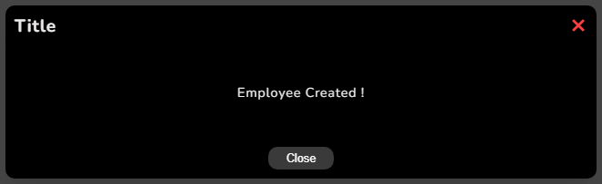

# SG Modal Library


🖥 [Tester la librairie sur CodeSandBox](https://codesandbox.io/p/devbox/sg-modal-lib-test-kgm332)

🔎 [Voir la librairie sur npm](https://www.npmjs.com/package/sg-modal-lib)

**sg-modal-lib** is a simple and flexible React library for creating and managing modals in your web applications.
It allows you to easily create custom modals with themes and configurations.

## Features

- **Easy to use** : Simple library for creating modals.
- **Customizable** : Apply different themes (light/dark) and custom button text.
- **Lightweight** : Built with minimal dependencies to keep your bundle size small.

## Installation

### Prerequisites

- **[NodeJS](https://nodejs.org/fr/)** (^20.11.1)
- **[npm](https://www.npmjs.com/)** (^10.2.4)
- **IDE** (VSCode recommended)

To install the `sg-modal-lib` library, you can use npm, pnpm or yarn :

```
npm install sg-modal-lib
```

or

```
pnpm install sg-modal-lib
```

or

```
yarn add sg-modal-lib
```

## Usage

Here's a basic example of how to use the `Modal` component in your React application :

```javascript
import { useState } from 'react';
import { Modal } from 'sg-modal-lib';
import 'sg-modal-lib/style.css'; // Import default styles function

const App = () => {
  const [isModalOpen, setIsModalOpen] = useState(false);

  const toggleModal = {
    setIsModalOpen((prevIsOpen) => !prevIsOpen);
  };

  return (
    <div>
      <button onClick={toggleModal}>Open Modal</button>
      <Modal
        isOpen={isModalOpen}
        toggleModal={toggleModal}
        title='Title' /* Optionnal, default to null */
        btnText='close' /* Optionnal, default to null */
        escapeClose={false} /* Optionnal, default to true */
        overlayClickClose={false} /* Optionnal, default to true */
        showClose={false} /* Optionnal, default to true */
        fadeDuration={300} /* Optionnal, default to 0 */
        styleTheme='dark' /* Optionnal, default to light */
      >
        <p>This is the content inside the modal!</p>
      </Modal>
    </div>
  );
};

export default App;
```

## Props

### Modal

The `Modal` component accepts the following props :
| Name | Type | Required | Default value | Description |
| --- | --- | --- | --- | --- |
| **`isOpen`** | boolean | yes | / | Indicates whether the modal is open or closed |
| **`toggleModal`** | function | yes | / | Function to toggle the modal's visibility |
| **`children`** | React.ReactNode | yes | / | The content to be displayed inside the modal |
| **`escapeClose`** | boolean | no | true | Allows the user to close the modal by pressing `ESC` |
| **`overlayClickClose`** | boolean | no | true | Allows the user to close the modal by clicking the overlay |
| **`showClose`** | boolean | no | true | Shows a (X) icon/link in the top-right corner |
| **`title`** | string | no | null | The title of the modal, displayed on top if provided. If no provided, it's not displayed. |
| **`btnText`** | string | no | null | The text for the additionnal bottom to close the modal, if provided. If no btnText provided, no button is displayed. |
| **`styleTheme`** | string | no | light | Optional theme for the modal (e.g., `'light'`, `'dark'`). |
| **`fadeDuration`** | number | no | 0 | Number of milliseconds the fade transition takes |

## Styling

The library includes default styles that can be imported using :

```javascript
import 'sg-modal-lib/style.css';
```

You can also override these styles in your project by applying additional styles.

Css className :

- sg-modal-lib
- sg-modal-lib--open
- sg-modal-lib--close
- sg-modal-lib\_\_dialog
- sg-modal-lib\_\_dialog--open
- sg-modal-lib\_\_dialog--close
- sg-modal-lib\_\_close
- sg-modal-lib\_\_title
- sg-modal-lib\_\_children
- sg-modal-lib\_\_btn

> Remember to import the CSS file before your own so that you can override it.

Light theme : <br>
 <br>
Dark theme : <br>
 <br>

## Dependencies

### Production Dependencies

- **[react](https://www.npmjs.com/package/react)**: ^18.3.1
- **[react-dom](https://www.npmjs.com/package/react-dom)**: ^18.3.1
- **[prop-types](https://www.npmjs.com/package/prop-types)**: ^15.8.1

### Development Dependencies

- **[vite](https://www.npmjs.com/package/vite)**: ^5.4.8
- **[sass](https://www.npmjs.com/package/sass)**: ^1.79.4
- **[copyfiles](https://www.npmjs.com/package/copyfiles)**: ^2.4.1
- **[@testing-library/react](https://www.npmjs.com/package/@testing-library/react)**: ^16.0.1
- **[@vitejs/plugin-react](https://www.npmjs.com/package/@vitejs/plugin-react)**: ^4.3.2
- **[@vitest/coverage-v8](https://www.npmjs.com/package/@vitest/coverage-v8)**: ^2.1.2
- **[globals](https://www.npmjs.com/package/globals)**: ^15.11.0
- **[jsdom](https://www.npmjs.com/package/jsdom)**: ^25.0.1
- **[vitest](https://www.npmjs.com/package/vitest)**: ^2.1.2
- **[eslint](https://www.npmjs.com/package/eslint)**: ^9.12.0
- **[eslint-plugin-react](https://www.npmjs.com/package/eslint-plugin-react)**: ^7.37.1
- **[eslint-plugin-react-hooks](https://www.npmjs.com/package/eslint-plugin-react-hooks)**: ^4.6.2
- **[eslint-plugin-react-refresh](https://www.npmjs.com/package/eslint-plugin-react-refresh)**: ^0.4.12

## Authors

- **Ségolène Ganzin** - Initial work and main development ([GitHub Profile](https://github.com/segoleneganzin/))
