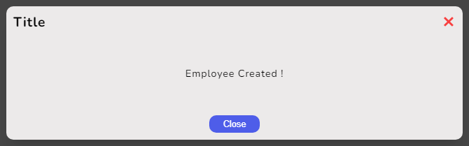

# SG Modal Library


**sg-modal** is a simple and flexible React library for creating and managing modals in your web applications.
It allows you to easily create custom modals with themes and configurations.

## Features

- **Easy to use** : Simple library for creating modals.
- **Customizable** : Apply different themes (light/dark) and custom button text.
- **Lightweight** : Built with minimal dependencies to keep your bundle size small.

## Installation

To install the `sg-modal` library, you can use npm or yarn :

```
npm install sg-modal
```

or

```
yarn add sg-modal
```

## Usage

Here's a basic example of how to use the `Modal` component in your React application :

```javascript
import { useState } from 'react';
import { Modal } from 'sg-modal';
import 'sg-modal/style.css'; // Import default styles function

const App = () => {
  const [isModalOpen, setIsModalOpen] = useState(false);
  const toggleModal = () => {
    setIsModalOpen(!isModalOpen);
  };

  return (
    <div>
      <button onClick={toggleModal}>Open Modal</button>
      {isModalOpen && (
        <Modal
          isOpen={isOpen}
          toggleModal={toggleModal}
          infos={{ title: 'Example Modal', btnText: 'Close' }}
          styleTheme='light'
        >
          <p>This is the content inside the modal!</p>
        </Modal>
      )}
    </div>
  );
};

export default App;
```

## Props

### Modal

The `Modal` component accepts the following props :

- **`isOpen`** (boolean, required): Indicates whether the modal is open or closed.
- **`toggleModal`** (function, required): Function to toggle the modal's visibility.
- **`infos`** (object, optional): Contains information for the modal.
  - **`title`** (string, optional): The title of the modal, displayed on top if provided. If no provided, it's not displayed.
  - **`btnText`** (string, optional): The text for the button to close the modal, if provided. If no provided, it's not displayed.
- **`children`** (React.ReactNode, required): The content to be displayed inside the modal.
- **`styleTheme`** (string, optional): Optional theme for the modal (e.g., `'light'`, `'dark'`). If no provided, default theme is applied.

## Styling

The library includes default styles that can be imported using :

```javascript
import 'sg-modal/style.css';
```

You can also override these styles in your project by applying additional styles.

> Remember to import the CSS file before your own so that you can override it.

Default theme : <br>
 <br>
Light theme : <br>
 <br>
Dark theme : <br>
 <br>

## Dependencies

### Production Dependencies

- **[react](https://www.npmjs.com/package/react)**: ^18.3.1
- **[react-dom](https://www.npmjs.com/package/react-dom)**: ^18.3.1
- **[prop-types](https://www.npmjs.com/package/prop-types)**: ^15.8.1

### Development Dependencies

- **[vite](https://www.npmjs.com/package/vite)**: ^5.4.0
- **[sass](https://www.npmjs.com/package/sass)**: ^1.77.8
- **[eslint](https://www.npmjs.com/package/eslint)**: ^9.8.0
- **[eslint-plugin-react](https://www.npmjs.com/package/eslint-plugin-react)**: ^7.35.0
- **[eslint-plugin-react-hooks](https://www.npmjs.com/package/eslint-plugin-react-hooks)**: ^5.1.0-rc.0
- **[copyfiles](https://www.npmjs.com/package/copyfiles)**: ^2.4.1

## Authors

- **Ségolène Ganzin** - Initial work and main development ([Your GitHub Profile](https://github.com/segoleneganzin/))
